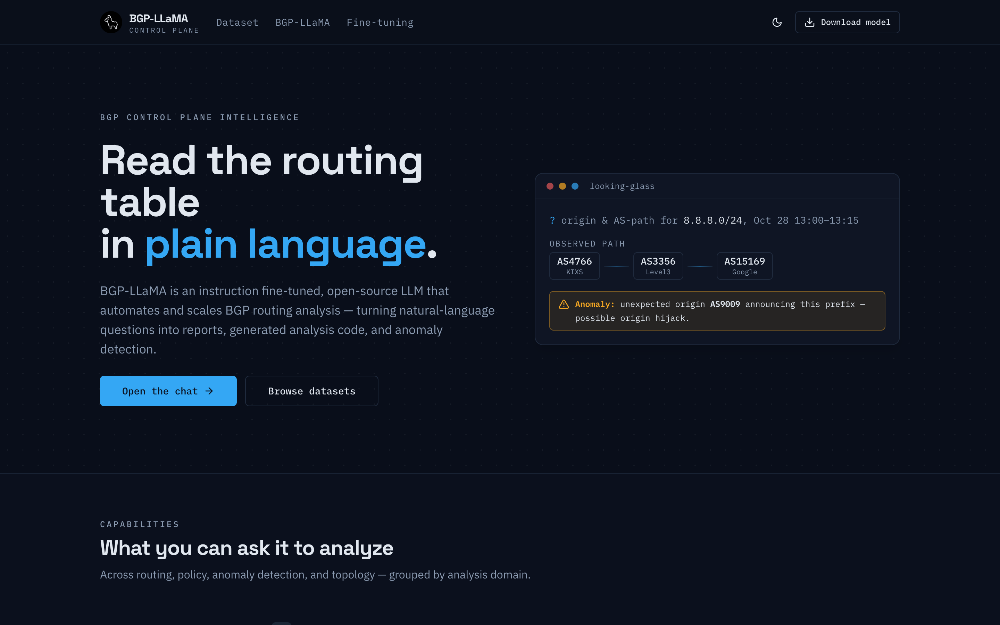
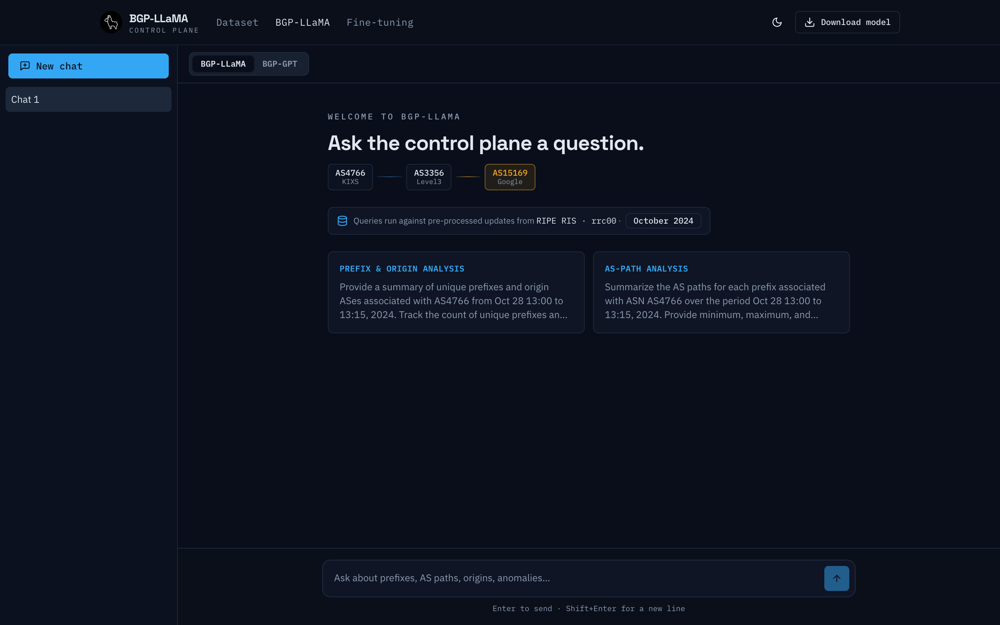
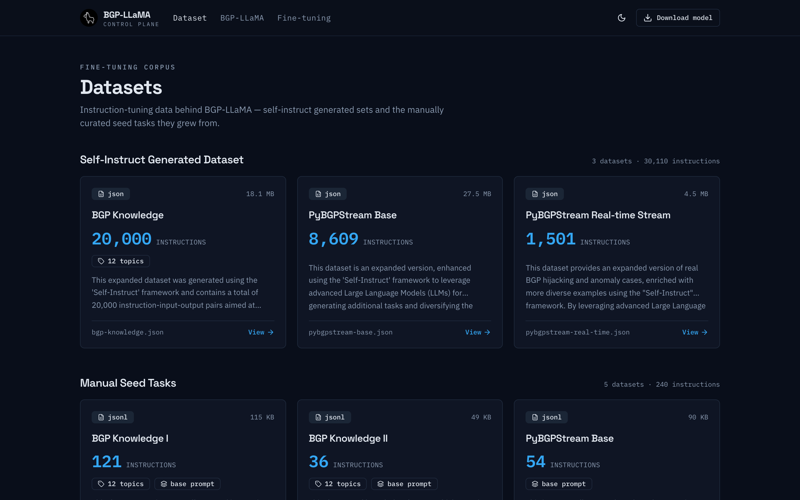
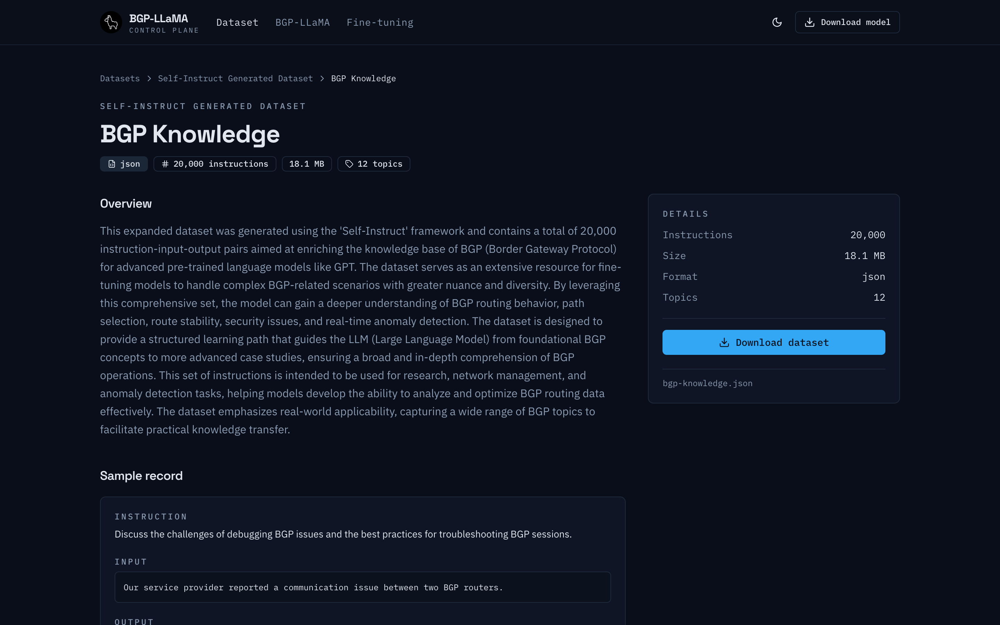
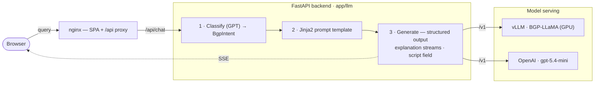

# BGP-LLaMA Webservice

AI-powered web application for **BGP routing analysis and anomaly detection**. It pairs an
instruction fine-tuned **LLaMA** model with **GPT (gpt-5.4-mini)** to turn natural-language
questions into BGP insights and runnable analysis code, streaming the reasoning back live over SSE.

🔗 **Live demo:** [llama.cnu.ac.kr](https://llama.cnu.ac.kr/)

> **Original codebase:** 2024-01-25 → 2025-04-04 — master's thesis work (Django + FastAPI).
> **Update & refactor:** 2026-07-09 onward — modernized and consolidated to a single FastAPI
> backend with vLLM-based model serving.

## Screenshots

|  |  |
| :---: | :---: |
| <br>_Home — hero & looking-glass_ | <br>_Chat — model switch, streaming, examples_ |
| <br>_Datasets — instruction corpus_ | <br>_Dataset detail — sample record & topics_ |

---

## Architecture

A natural-language query is **classified** — a structured GPT call returns the analysis type plus any
extracted parameters (target ASN, prefixes, time window) — which selects a **Jinja2 prompt template**.
The chosen model then **generates** the answer as structured output: the natural-language analysis
streams live over SSE while the pybgpstream script is returned as a dedicated field (no fragile
fenced-block parsing). Both models are reached through **one** OpenAI-compatible client — the local
fine-tuned LLaMA is served by **vLLM**, GPT by OpenAI — so they differ only by base URL / key / model.
The FastAPI backend does no in-process inference; nginx serves the React build and proxies `/api`.




<details>
<summary>Original ASCII diagram (archived)</summary>

```
                    ┌────────────────────────────────────┐
   Browser ────────▶│  nginx  — serves SPA, proxies /api   │
                    └───────────────┬──────────────────────┘
                            /api/*  │  (SSE: buffering off)
                                    ▼
                    ┌────────────────────────────────────┐
                    │  FastAPI  (gunicorn + uvicorn) :8002 │
                    │  /api/chat/*  SSE streaming          │
                    │  /api/download  artifact download    │
                    │  CPU-only — no in-process inference   │
                    └──────┬───────────────────────┬───────┘
                           │ OpenAI-compatible /v1 │
                  ┌────────▼────────┐     ┌─────────▼─────────┐
                  │ vLLM :8000       │     │ OpenAI API        │
                  │ local BGP-LLaMA  │     │ gpt-5.4-mini      │
                  │ (GPU / CUDA)     │     │                   │
                  └──────────────────┘     └───────────────────┘
```

</details>

- **FastAPI backend** ([`app/`](./app/)) — the classify → prompt → generate pipeline (`app/llm/`),
  SSE streaming for the LLaMA and GPT chatbots, and a guarded file-download endpoint. Config is
  env-driven via `pydantic-settings`; both providers flow through one OpenAI-compatible client.
- **vLLM** — serves the fine-tuned LLaMA over an OpenAI-compatible `/v1` API (GPU-backed). The only
  component that needs a GPU.
- **React SPA** ([`react_frontend/`](./react_frontend/)) — Vite + React 18 + TypeScript, Tailwind +
  shadcn/ui.
- **nginx** — serves the React build at the web root (SPA fallback) and reverse-proxies `/api` to
  FastAPI with buffering disabled for SSE.

## Tech stack

| Layer     | Technologies                                                        |
| --------- | ------------------------------------------------------------------- |
| Backend   | FastAPI, gunicorn + uvicorn, `openai` SDK, pydantic-settings, Jinja2 |
| Serving   | vLLM (OpenAI-compatible), OpenAI API (gpt-5.4-mini)                  |
| Frontend  | React 18, TypeScript, Vite, Tailwind CSS, shadcn/ui, Axios          |
| Streaming | Server-Sent Events (SSE)                                            |
| Tests     | pytest (FastAPI `TestClient`, LLM mocked)                           |
| DevOps    | Docker Compose, nginx, NVIDIA CUDA runtime (for vLLM)               |

## Repository layout

```
.
├── app/                     # FastAPI backend
│   ├── main.py              #   app factory (routers mounted under /api)
│   ├── core/                #   config.py (pydantic-settings), logging.py
│   ├── llm/                 #   schemas.py (BgpIntent/BgpScript), classifier.py,
│   │                        #   generation.py (streaming SO), providers.py, service.py
│   └── api/routes/          #   health.py, chat.py (SSE), files.py (download)
├── prompts/                 # Jinja2 templates (templates/*.j2) + loader.py
├── tests/                   # pytest suite (LLM mocked; no network)
├── react_frontend/          # React + TS SPA (Vite; build/ served by nginx)
├── docker/                  # Dockerfile.api + nginx config
├── docker-compose.*.yml     # base + dev/prod overrides
├── pyproject.toml           # ruff + mypy + pytest config
├── requirements.txt         # backend deps (slim)
└── requirements-dev.txt     # + pytest
```

## Prerequisites

- Docker & Docker Compose **v2** (`docker compose`)
- NVIDIA GPU + drivers + NVIDIA Container Toolkit — required only for the `vllm` service
- For manual (non-Docker) setup: Python 3.12, Node.js 18+

## Quickstart (Docker)

```bash
# 1. Configure environment
cp .env.example .env
#    set OPENAI_API_KEY, hf_token, and the LLAMA_* / VLLM_* values as needed

# 2. Build the SPA so nginx has something to serve
cd react_frontend && yarn install && yarn build && cd ..

# 3. Build + start the dev stack (vllm + api + nginx), tailing logs
make up-dev

# Stop it
make down-dev
```

Run `make help` to list all targets. Services once up:

| Service  | URL / port            |
| -------- | --------------------- |
| nginx    | http://localhost:80   |
| FastAPI  | http://localhost:8002 |
| vLLM     | http://localhost:8000 |

> **No GPU?** The `vllm` service needs an NVIDIA host. On a laptop, skip Docker for the backend and
> run it directly (below), pointing `LLAMA_BASE_URL` at a remote vLLM — or just use GPT.

## Manual setup (without Docker)

```bash
# --- Backend ---
python3.12 -m venv .venv && source .venv/bin/activate
pip install -r requirements-dev.txt
cp .env.example .env            # set OPENAI_API_KEY, LLAMA_BASE_URL, etc.

uvicorn app.main:app --reload --port 8002       # needs a reachable model server
pytest                                          # run the test suite

# --- Frontend (Vite + TypeScript) ---
cd react_frontend
yarn install
yarn dev          # dev server on :3000, proxies /api -> :8002
yarn build        # production build -> react_frontend/build (served by nginx)
yarn typecheck    # tsc --noEmit
yarn lint         # ESLint (--fix)
```

> The dev server proxies `/api` to the backend, so you can run just the frontend (`yarn dev`)
> against a running FastAPI and iterate without CORS setup. The backend base URL is configurable
> via `VITE_API_URL`.

## Environment variables

All configuration is read from `.env` (git-ignored) via `pydantic-settings`; unknown keys are
ignored. See [`.env.example`](./.env.example) for the documented list. Key groups:

- **HTTP** — `CORS_ALLOWED_ORIGINS` (comma-separated), `LOG_LEVEL`
- **GPT** — `OPENAI_API_KEY`, `OPENAI_MODEL`, `OPENAI_BASE_URL`, `GPT_TEMPERATURE`, `GPT_MAX_TOKENS`
- **Local LLaMA (vLLM)** — `LLAMA_BASE_URL`, `LLAMA_MODEL`, `LLAMA_API_MODE` (`completion`|`chat`),
  `LLAMA_TEMPERATURE`, `LLAMA_MAX_TOKENS`, `LLAMA_REPETITION_PENALTY`
- **vLLM container** — `VLLM_DTYPE`, `VLLM_MAX_MODEL_LEN`, `VLLM_GPU_MEMORY_UTILIZATION`,
  `VLLM_TENSOR_PARALLEL_SIZE`, `hf_token`

`LLAMA_API_MODE=completion` (default) sends a raw prompt to vLLM's `/v1/completions`, matching the
fine-tune's training format; set `chat` if you serve a chat template.

## Development tooling

```bash
pip install -r requirements-dev.txt
pytest                      # unit tests (config, providers, classification, prompts, SSE, downloads)

pip install pre-commit
pre-commit install
pre-commit run --all-files  # ruff (lint+format), mypy, frontend prettier/eslint
```

- **Backend:** [ruff](https://docs.astral.sh/ruff/) for lint + format and mypy, configured in
  [`pyproject.toml`](./pyproject.toml). Tests use FastAPI's `TestClient` and mock the LLM, so they
  never hit OpenAI or vLLM.
- **Frontend:** ESLint + Prettier (`cd react_frontend && yarn lint && yarn prettier`).

## Notes

- The React SPA is built with Vite to `react_frontend/build/` and served by **nginx** at the web
  root. The build output is git-ignored — run `yarn build` before `make up-*`.
- TLS is not wired into the base nginx config; add a cert-aware server block in the prod override
  before deploying publicly.
- `requirements.legacy.txt` preserves the pre-refactor dependency set (Django + the
  torch/transformers/BGPStream training stack) for reference only.
