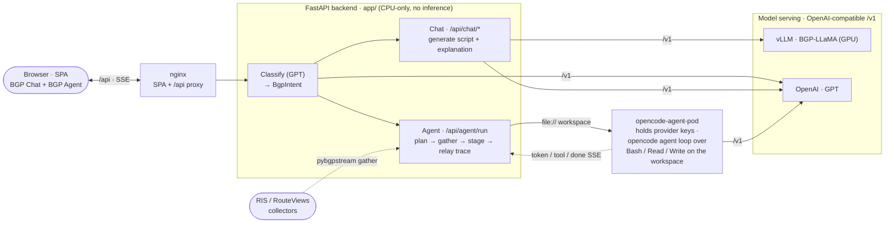

# BGP-LLaMA Webservice

AI-powered web application for **BGP routing analysis and anomaly detection**. It pairs an
instruction fine-tuned **LLaMA** model with **GPT (gpt-5.4-mini)** to turn natural-language
questions into BGP insights and runnable analysis code, streaming the reasoning back live over SSE.
A separate **BGP Agent** mode goes further — it *runs* the analysis autonomously via
[opencode-agent-pod](https://github.com/hyonbokan/opencode-agent-pod) (built on
[opencode](https://opencode.ai)) and streams a live tool-by-tool trace. See
[BGP Agent — autonomous analysis](#bgp-agent--autonomous-analysis) below.

🔗 **Live demo:** [llama.cnu.ac.kr](https://llama.cnu.ac.kr/)

> **Original codebase:** 2024-01-25 → 2025-04-04 — master's thesis work.
> **Update & refactor:** 2026-07-09 onward — modernized and consolidated to a single FastAPI
> backend with vLLM-based model serving.

## Screenshots

|  |  |
| :---: | :---: |
| <br>_Home — hero & looking-glass_ | <br>_Chat — model switch, streaming, examples_ |
| <br>_Datasets — instruction corpus_ | <br>_Dataset detail — sample record & topics_ |

---

## Architecture

A natural-language query is **classified** — a structured GPT call returns the analysis type plus any
extracted parameters (target ASN, prefixes, time window). From there the request takes one of two
paths:

- **BGP Chat** *generates* the answer. A Jinja2 template routes the query; the chosen model returns
  structured output — the natural-language analysis streams over SSE while a pybgpstream script comes
  back as a dedicated field (no fragile fenced-block parsing). You run the script yourself.
- **BGP Agent** *runs* the analysis. The backend gathers the scoped updates with pybgpstream, stages
  them as a read-only workspace, and dispatches one autonomous run to **opencode-agent-pod** — a
  separate service that holds the provider keys and drives an opencode agent loop (write code, run it,
  observe, self-correct) over the staged data, streaming a live tool-by-tool trace back.

Chat models are reached through **one** OpenAI-compatible client — the fine-tuned LLaMA via **vLLM**,
GPT via OpenAI — so they differ only by base URL / key / model. The FastAPI backend does no
in-process inference; nginx serves the React build and proxies `/api`.




<details>
<summary>Original ASCII diagram (archived — chat path only, pre-agent)</summary>

```
                    ┌────────────────────────────────────┐
   Browser ────────▶│  nginx  — serves SPA, proxies /api   │
                    └───────────────┬──────────────────────┘
                            /api/*  │  (SSE: buffering off)
                                    ▼
                    ┌────────────────────────────────────┐
                    │  FastAPI  (gunicorn + uvicorn) :8002 │
                    │  /api/chat/*  SSE streaming          │
                    │  /api/download  artifact download    │
                    │  CPU-only — no in-process inference   │
                    └──────┬───────────────────────┬───────┘
                           │ OpenAI-compatible /v1 │
                  ┌────────▼────────┐     ┌─────────▼─────────┐
                  │ vLLM :8000       │     │ OpenAI API        │
                  │ local BGP-LLaMA  │     │ gpt-5.4-mini      │
                  │ (GPU / CUDA)     │     │                   │
                  └──────────────────┘     └───────────────────┘
```

</details>

- **FastAPI backend** ([`app/`](./app/)) — two SSE paths over one classifier: **Chat** (`/api/chat/*`,
  the classify → template → generate pipeline in `app/llm/`) and **Agent** (`/api/agent/run`, which
  gathers + stages BGP data and proxies an autonomous run to the pod), plus a guarded file-download
  endpoint. Config is env-driven via `pydantic-settings`; chat providers flow through one
  OpenAI-compatible client.
- **opencode-agent-pod** ([`opencode-agent-pod`](https://github.com/hyonbokan/opencode-agent-pod)) — a separate, reusable
  service (built on [opencode](https://opencode.ai)) that runs the autonomous agent loop and **holds
  the provider keys**; the backend proxies one run per BGP Agent question and relays its
  `token`/`tool`/`done` SSE. Keys never cross back into this backend. See
  [BGP Agent](#bgp-agent--autonomous-analysis).
- **BGP data layer** ([`app/bgp/`](./app/bgp/)) — turns a classified intent into a bounded gather plan,
  fetches the scoped updates with **pybgpstream**, reduces them to compact records, and stages them as
  the agent's workspace (falls back to a bundled synthetic sample on a host without BGPStream).
- **vLLM** — serves the fine-tuned LLaMA over an OpenAI-compatible `/v1` API (GPU-backed). The only
  component that needs a GPU.
- **React SPA** ([`react_frontend/`](./react_frontend/)) — Vite + React 18 + TypeScript, Tailwind +
  shadcn/ui.
- **nginx** — serves the React build at the web root (SPA fallback) and reverse-proxies `/api` to
  FastAPI with buffering disabled for SSE.

## Tech stack

| Layer     | Technologies                                                        |
| --------- | ------------------------------------------------------------------- |
| Backend   | FastAPI, gunicorn + uvicorn, `openai` SDK, pydantic-settings, Jinja2 |
| Serving   | vLLM (OpenAI-compatible), OpenAI API (gpt-5.4-mini)                  |
| Frontend  | React 18, TypeScript, Vite, Tailwind CSS, shadcn/ui, Axios          |
| Streaming | Server-Sent Events (SSE)                                            |
| Tests     | pytest (FastAPI `TestClient`, LLM mocked)                           |
| DevOps    | Docker Compose, nginx, NVIDIA CUDA runtime (for vLLM)               |

## Repository layout

```
.
├── app/                     # FastAPI backend
│   ├── main.py              #   app factory (routers mounted under /api)
│   ├── core/                #   config.py (pydantic-settings), logging.py
│   ├── llm/                 #   schemas.py (BgpIntent/BgpScript), classifier.py,
│   │                        #   generation.py (streaming SO), providers.py, service.py
│   └── api/routes/          #   health.py, chat.py (SSE), agent.py (SSE → pod), files.py (download)
├── prompts/                 # Jinja2 templates (templates/*.j2) + loader.py
├── tests/                   # pytest suite (LLM mocked; no network)
├── react_frontend/          # React + TS SPA (Vite; build/ served by nginx)
├── docker/                  # Dockerfile.api, Dockerfile.web (SPA build + nginx), nginx config
├── docker-compose.*.yml     # base + dev/prod overrides
├── pyproject.toml           # ruff + mypy + pytest config
├── requirements.txt         # backend deps (slim)
└── requirements-dev.txt     # + pytest
```

## Prerequisites

- Docker & Docker Compose **v2** (`docker compose`)
- NVIDIA GPU + drivers + NVIDIA Container Toolkit — required only for the `vllm` service
- For manual (non-Docker) setup: Python 3.12, Node.js 18+

## Quickstart (Docker)

```bash
# 1. Configure environment
cp .env.example .env
#    set OPENAI_API_KEY, hf_token, and the LLAMA_* / VLLM_* values as needed

# 2. Build + start the dev stack (vllm + api + nginx), tailing logs
#    The web image builds the SPA itself — no host Node or manual yarn build.
make up-dev        # full stack (needs an NVIDIA GPU host for vllm)
make up-nogpu      # api + nginx only — skips vllm entirely (GPT path); no GPU
make down-dev      # stop whichever you started
```

Run `make help` to list all targets. Services once up:

| Service  | URL / port            | Started by            |
| -------- | --------------------- | --------------------- |
| nginx    | http://localhost:80   | `up-dev`, `up-nogpu`  |
| FastAPI  | http://localhost:8002 | `up-dev`, `up-nogpu`  |
| vLLM     | http://localhost:8000 | `up-dev` only         |

> **No GPU?** The `vllm` image is large and needs an NVIDIA host. Use **`make up-nogpu`** to run just
> `api + nginx` under Docker (uses `--no-deps`, so vllm is never pulled and the health-gate is
> skipped) — the local-LLaMA chat won't work, but the GPT path and the SPA do. Point `LLAMA_BASE_URL`
> at a remote vLLM if you want the LLaMA path too, or use `make dev` for the no-Docker host workflow.

## Manual setup (without Docker)

The fastest path once the venv and `node_modules` exist: **`make dev`** starts the backend (:8002)
and the Vite frontend (:3000) together — open http://localhost:3000, and Ctrl-C stops both. The
individual steps below are what it runs.

```bash
# --- Backend ---
python3.12 -m venv .venv && source .venv/bin/activate
pip install -r requirements-dev.txt
cp .env.example .env            # set OPENAI_API_KEY, LLAMA_BASE_URL, etc.

uvicorn app.main:app --reload --port 8002       # needs a reachable model server
pytest                                          # run the test suite

# --- Frontend (Vite + TypeScript) ---
cd react_frontend
yarn install
yarn dev          # dev server on :3000, proxies /api -> :8002
yarn build        # production build -> react_frontend/build (served by nginx)
yarn typecheck    # tsc --noEmit
yarn lint         # ESLint (--fix)
```

> The dev server proxies `/api` to the backend, so you can run just the frontend (`yarn dev`)
> against a running FastAPI and iterate without CORS setup. The backend base URL is configurable
> via `VITE_API_URL`.

## BGP Agent — autonomous analysis

The **BGP Agent** (nav **BGP Agent**, route `/bgp_agent`) *runs* the analysis for you instead of
handing you a script: an autonomous loop that writes Python, executes it, self-corrects, and streams a
live **step trace** — each `Bash`/`Read`/`Write` call (pending → running → completed, with its command
and output) and the answer as it's written — ending in a result card with cost, turns, and duration.

The agent loop and the provider keys live in a separate service,
**[opencode-agent-pod](https://github.com/hyonbokan/opencode-agent-pod)**, built on
**[opencode](https://opencode.ai)** — this
backend proxies one run per question and re-streams the pod's events. **Keys never cross into this
backend.**

### Two ways to run

The only difference is where the agent's BGP data comes from. When pybgpstream is importable the
backend gathers the scoped updates live; otherwise it automatically stages the bundled synthetic
sample (`sample_bgp_data/`) — so the **quick demo works out of the box on any host, no BGPStream and
no config needed.** The setup steps below are identical for both.

| | **Quick demo** | **Full data** |
| --- | --- | --- |
| Data source | bundled synthetic sample (used automatically) | live gather via **pybgpstream** |
| Setup | none | install the BGPStream runtime (`docker/Dockerfile.bgpstream`; won't `pip install` on macOS) |
| Good for | seeing the trace; both example queries answer | real routing analysis |

For real data, install pybgpstream **or** point `BGP_DATA_ROOT` at a directory of already-staged
records. Set `BGP_SAMPLE_DATA_ROOT=` (empty) to turn the synthetic fallback off entirely.

### Setup (3 steps)

**Prereqs:** the pod ([opencode-agent-pod](https://github.com/hyonbokan/opencode-agent-pod)) cloned
next to this repo at `../opencode-agent-pod`, with its own `.venv`,
**[opencode](https://opencode.ai)** on `PATH` (`opencode --version` → **1.17.11**; or run the pod's
Docker image instead — see its `DEPLOY.md`), and a provider key for the agent model.

**1 · Start the pod** (Terminal A) — it holds the keys and the agent loop:

```bash
cd ../opencode-agent-pod && cp env.example .env
# In .env set:  AGENT_POD_TOKEN=local-dev-pod-token   (required; the pod fails closed without it)
#               OPENAI_API_KEY=sk-...                  (a REAL key — env.example ships a placeholder)
.venv/bin/python -m pod          # http://localhost:8080  ·  check: curl -s localhost:8080/health
```

**2 · Start the backend + frontend** (Terminal B) — set in **this** repo's `.env`:

```bash
AGENT_POD_URL=http://localhost:8080
AGENT_POD_TOKEN=local-dev-pod-token           # must match the pod's token
OPENAI_API_KEY=sk-...                         # for the query classifier
# AGENT_MODEL defaults to gpt-5.4-mini-2026-03-17 (OpenAI). Anthropic instead:
#   AGENT_MODEL=claude-haiku-4-5-20251001  (+ set ANTHROPIC_API_KEY in the pod)
# BGP_DATA_ROOT — leave unset for the quick demo (the synthetic sample is used automatically).
```

```bash
make dev     # backend :8002 + Vite :3000  (needs the venv + node_modules from "Manual setup")
```

**3 · Run it** — open **http://localhost:3000 → BGP Agent** and click a suggested example (or ask your
own). Watch the live tool trace stream, then the result card. The bundled `sample_bgp_data/` answers
both suggested examples (`8.8.8.0/24` / AS15169 and `1.1.1.0/24` / AS13335).

## Environment variables

All configuration is read from `.env` (git-ignored) via `pydantic-settings`; unknown keys are
ignored. See [`.env.example`](./.env.example) for the documented list. Key groups:

- **HTTP** — `CORS_ALLOWED_ORIGINS` (JSON array), `LOG_LEVEL`
- **GPT** — `OPENAI_API_KEY`, `OPENAI_MODEL`, `OPENAI_BASE_URL`
- **Local LLaMA (vLLM)** — `LLAMA_BASE_URL`, `LLAMA_MODEL`, `LLAMA_API_MODE` (`completion`|`chat`),
  `LLAMA_TEMPERATURE`, `LLAMA_MAX_TOKENS`, `LLAMA_REPETITION_PENALTY`
- **vLLM container** — `VLLM_DTYPE`, `VLLM_MAX_MODEL_LEN`, `VLLM_GPU_MEMORY_UTILIZATION`,
  `VLLM_TENSOR_PARALLEL_SIZE`, `hf_token`
- **BGP Agent (opencode-agent-pod)** — `AGENT_POD_URL`, `AGENT_POD_TOKEN` (must match the pod),
  `AGENT_MODEL`, `AGENT_TOOLS` (JSON array), `AGENT_MAX_BUDGET_USD`, `AGENT_REQUEST_TIMEOUT`,
  `BGP_DATA_ROOT` (fallback workspace). See [BGP Agent — autonomous analysis](#bgp-agent--autonomous-analysis)
- **BGP gather bounds (agent path)** — `BGP_GATHER_DEFAULT_WINDOW_MINUTES`,
  `BGP_GATHER_MAX_WINDOW_MINUTES`, `BGP_GATHER_DEFAULT_COLLECTORS` (JSON array),
  `BGP_GATHER_MAX_COLLECTORS`, `BGP_GATHER_MAX_RECORDS`, `BGP_GATHER_TIMEOUT_SECONDS`, `BGP_STAGE_ROOT`,
  `BGP_SAMPLE_DATA_ROOT` (synthetic fallback dataset; empty disables it)

`LLAMA_API_MODE=completion` (default) sends a raw prompt to vLLM's `/v1/completions`, matching the
fine-tune's training format; set `chat` if you serve a chat template.

## Development tooling

```bash
pip install -r requirements-dev.txt
pytest                      # unit tests (config, providers, classification, prompts, SSE, downloads)

pip install pre-commit
pre-commit install
pre-commit run --all-files  # ruff (lint+format), mypy, frontend prettier/eslint
```

- **Backend:** [ruff](https://docs.astral.sh/ruff/) for lint + format and mypy, configured in
  [`pyproject.toml`](./pyproject.toml). Tests use FastAPI's `TestClient` and mock the LLM, so they
  never hit OpenAI or vLLM.
- **Frontend:** ESLint + Prettier (`cd react_frontend && yarn lint && yarn prettier`).

## Notes

- The React SPA is built with Vite and served by **nginx** at the web root. Under Docker the web
  image builds it in a multi-stage `docker/Dockerfile.web` (no host Node needed); for the manual
  workflow `yarn dev` serves it directly. The `react_frontend/build/` output is git-ignored.
- TLS is not wired into the base nginx config; add a cert-aware server block in the prod override
  before deploying publicly.
